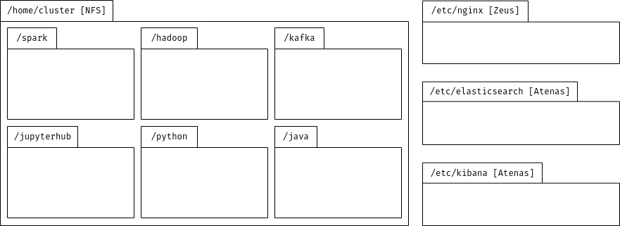
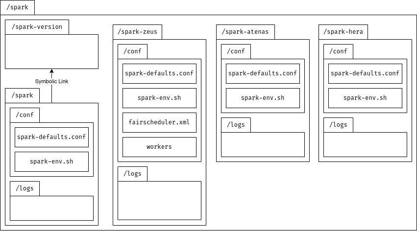
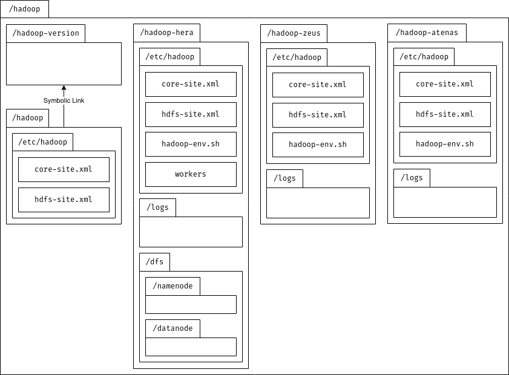
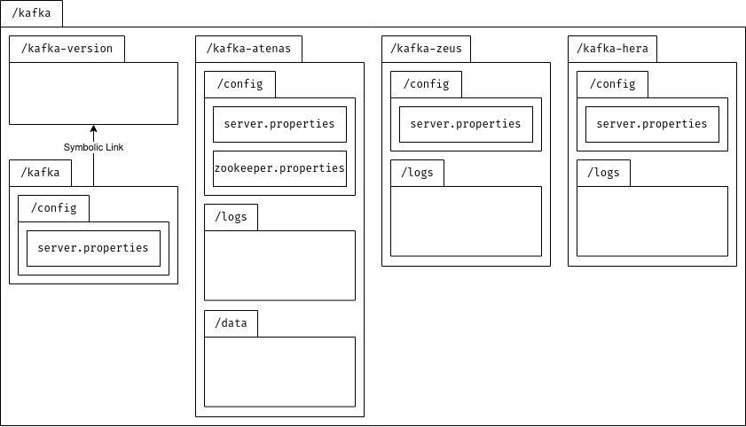
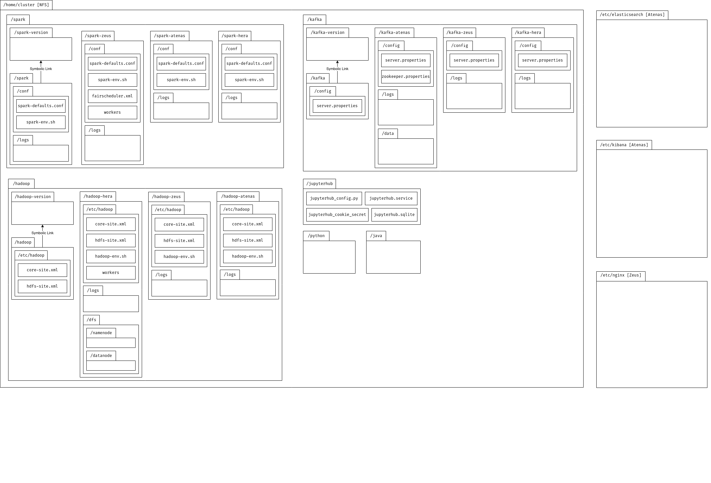

<h1 align="center">
    
    <br>
    Arquitetura Cluster
    <br>
</h1>

<h4 align="center">Ambiente clusterizado montado para suprir as necessidade do TCC e dos alunos de Software da FGA (UnB).</h4>

<p align="center">
  <a href="#arquitetura">Arquitetura</a> •
  <a href="#tecnologias-utilizadas">Tecnologias Utilizadas</a> •
  <a href="#acessando-o-cluster">Acessando o Cluster</a>
</p>

---

## Arquitetura

<p align="justify">A arquitetura atualmente (28/05/2023) possui três máquinas e é focada em distribuir <a href="#tecnologias-utilizadas">sete serviços</a>, entretanto diversos outros software (OpenMP, MPI e Proxmox (<b>TODO</b>)) estão disponíveis para utilização no cluster de máquinas. As configurações relativas aos servidores são:</p>

- `zeus`: Xeon X7460 - 24 cores, 125G de memória e \~572G de armazenamento
- `atenas`: Xeon E5620 - 16 cores, 23G de memória e \~98G de armazenamento
- `hera`: Xeon E5504 - 8 cores, 11G de memória e \~815G de armazenamento

<p align="justify">Os serviços em funcionamento seguem a mesma estrutura de pastas (genérica) presente nesse repositório. Para facilitar a visualização os seguintes diagramas foram confeccionados:</p>

<details open>
<summary><h3 align="center">Diagrama geral de pastas</h3></summary>
    
</details>

<details open>
<summary><h3 align="center">Diagrama de pastas do Spark</h3></summary>
    
</details>

<details open>
<summary><h3 align="center">Diagrama de pastas do Hadoop</h3></summary>
    
</details>

<details open>
<summary><h3 align="center">Diagrama de pastas do Kafka</h3></summary>
    
</details>

<details>
<summary><h3 align="center">Diagrama completo de pastas</h3></summary>
    
</details>

---

## Tecnologias Utilizadas

### `Spark`

<p align="justify"><i>Software</i> voltado para engenharia de dados, ciência de dados e aprendizado de máquina em clusters ou máquinas com um único nó. [1] Utilizado principalmente para realização do processamento em <i>streaming</i> provido pelo Kafka, bem como o aprendezido de máquina através da Mllib.</p>

#### Configuração atual:
- `zeus`: Spark master e Spark worker
- `atenas`: Spark worker
- `hera`: Spark worker

### `Hadoop`

<p align="justify"><i>Framework</i> que permite processamento e armazenamento distribuido de grandes conjuntos de dados de forma clusterizada. Projetada para fornecer alta disponibilidade e lidar com falhas. [2]</p>

#### Configuração atual:
- `zeus`: Datanode
- `atenas`: Datanode
- `hera`: Datanode e Namenode

### `Kafka`

<p align="justify">Plataforma para <i>streaming</i> de eventos de forma distribuída (clusterizada). [3] Visa prover uma forma de distribuir alta quantidade de dados para processamento em tempo real.</p>

#### Configuração atual:
- `zeus`: Kafka worker
- `atenas`: Zookerper e Kafka worker
- `hera`: Kafka worker

### `Jupyterhub`

<p align="justify">Ambiente que traz o poder dos <i>notebooks</i> em uma estrutura centralizada, sem sobrecarregar os usuários com instalações ou manutenções. Além disso, permite personalizações e fácil gerência por administradores. [4]</p>

#### Configuração atual:
- `zeus`: Jupyterhub e jupyterhub-single-user
  - `/tree`: Serviço utilizando [notebook](https://pypi.org/project/notebook/)
  - `/lab`: Serviço utilizando [jupyterlab](https://pypi.org/project/jupyterlab/)

### `Elasticsearch/Kibana`

<p align="justify">Mecanismo de busca e análise de dados distribuído construido em cima do Apache Lucene. Ferramenta utilizada para ingestão, enriquecimento, armazenamento, análise e visualização de dados. [5]</p>
<p align="justify">Como <i>frontend</i> desse serviço, é utilizado o Kibana permitindo uma melhor visualização dos dados providos pelo elasticsearch. [6]</p>

#### Configuração atual:
- `atenas`: Elasticsearch e Kibana

### `Nginx`

<p align="justify">Servidor HTTP e <i>proxy</i> reverso [7] responsável por prover uma interface centralizada para os serviços disperços nas diversas máquinas do cluster.</p>

#### Configuração atual:
- `zeus`: Servidor HTTP Nginx

---

## Acessando o Cluster

<p align="justify">Apenas alunos da FGA (UnB) possuem acesso ao cluster (atualmente). O nome do seu usuário será <b>aNUMERO_MATRICULA</b>, e caso seja seu primeiro acesso será necessário consultar com seu professor sua senha.</p>
<p align="justify">Se o seu objetivo principal for utilizar o Spark/Hadoop/Jupyterlab, basta acessar o endereço: <a href="">...</a>. Caso seja para utilizar os serviços diretamente, as seguintes portas estão disponíveis para acesso/tunelamento:</p>

|Serviço|Máquina(s)|Porta|
|---|---|---|
|ssh|-|13508|
|Hadoop|hera|9000|
|Spark|zeus|7077|
|Kafka|zeus, atenas, hera|9092|
|Zookeper|atenas|2181|
|Elasticsearch|atenas|9200|

### Conectando via SSH

```sh
ssh -p 13508 aMATRICULA@lca.unb.br
```

---

## Contribuidores
> João Pedro Moura [@Joao-Moura](https://github.com/Joao-Moura) &nbsp;&middot;&nbsp;
> Thiago Paiva [@thiagohdaqw](https://github.com/thiagohdaqw)

---

### Referências

> [1] Apache Spark. Disponível em: [https://spark.apache.org/](https://spark.apache.org/)
> 
> [2] Apache Hadoop. Disponível em: [https://spark.apache.org/](https://hadoop.apache.org/)
> 
> [3] Apache Kafka. Disponível em: [https://kafka.apache.org/](https://kafka.apache.org/)
> 
> [4] Jupyterhub. Disponível em: [https://jupyter.org/hub](https://jupyter.org/hub)
> 
> [5] Elasticsearch. Disponível em: [https://www.elastic.co/pt/what-is/elasticsearch](https://www.elastic.co/pt/what-is/elasticsearch)
> 
> [6] Kibana. Disponível em: [https://www.elastic.co/pt/kibana/](https://www.elastic.co/pt/kibana/)
> 
> [7] Nginx. Disponível em: [https://nginx.org/en/](https://nginx.org/en/)
